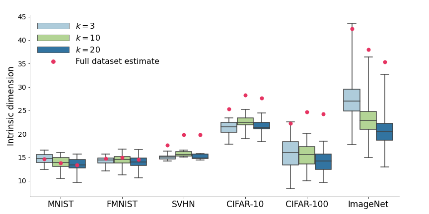

# Verifying the Union of Manifolds Hypothesis for Image Data

Code accompanying the [ICLR 2023](https://iclr.cc/) paper:

[**Verifying the Union of Manifolds Hypothesis for Image Data**](https://arxiv.org/abs/2207.02862)<br/>
Bradley Brown\,
Anthony L. Caterini\,
Brendan Leigh Ross\,
Jesse C. Cresswell\,
Gabriel Loaiza-Ganem<br/>
[[arXiv](https://arxiv.org/abs/2207.02862), [Video](https://iclr.cc/virtual/2023/poster/11032)]



## Requirements
A conda environment with all dependencies to run the repo can be created with:
```bash
conda env create -f env.yaml
conda activate uomh
```

# Using the Repo

This repo contains all the code required to reproduce the generative modelling results from the paper. Specifically, the code to run a variety of deep generative models (ex. VAEs, WAEs) using disconnected (as introduced in our paper), conditional and vanilla training. Additionally, two step models (as introduced in the [Two Step Paper](https://arxiv.org/abs/2204.07172)) can be trained by combining a generalized auto-encoder (ex. VAE, WAE) with a density estimator (ex. NF, VAE). 


## Training Models

The following scripts are used to train models:
- `single_main.py`: Used to train a non-disconnected, non-two-step model.
- `main.py`: Used to train a non-disconnected, two-step model.
- `single_cluster_main.py`: Used to train a disconnected, non-two-step model.
- `cluster_main.py`: Used to train a disconnected, two-step model.

Command line arguments can be found in the respective files, notable command line arguments include:
- `dataset : str`: which dataset to train on, options are `mnist`, `fashion-mnist`, `svhn`, `cifar10`, `cifar100`.
- `run-name : str`: name of folder to store the run.
- `model : str`: type of model for non-two-step runs, options are `vae`, `avb`, `ae`, `wae`, `bigan`, `gan`, `flow`, `ebm`, and `arm`. 
- `gae-model : str`: type of generalized autoencoder for two-step runs, options are `vae`, `avb`, `ae`, `wae`.
- `de-model : str`: type of density estimator for two-step runs, options are `vae`, `avb`, `flow`, `ebm`.

The config folder contains many more configuration options, organized as follows: 
```bash
├── config
│   ├── cluster_config.py # config for clustering/id estimation
│   ├── density_estimator.py # config for density estimator
│   ├── generalized_autoencoder.py # config for gae
│   ├── shared_config.py # config for general training
```

To change the default configuration options in these files, append `--CONFIG_TYPE CONFIG_NAME=CONFIG_VALUE` to the experiment run where
- If `CONFIG_NAME` is defined in the `cluster_config.py` file of the config directory, then `CONFIG_TYPE` is `cluster-config`. 
- Else, if not training a two-step model, it is `config`.
- Otherwise, it is `gae-config`, `de-config`, or `shared-config` if `CONFIG_NAME` is defined in the `generalized_autoencoder.py`, `density_estimator.py`, or `shared_config.py` file in the config directory respectively. 

Example commands are
```bash
./single_main.py --dataset mnist --model flow  --run-name runs/flow_mnist_run
./single_cluster_main.py --dataset svhn --model vae --run-name runs/flow_svhn_cluster_run/1 --config scale_data=True 
./cluster_main.py --dataset cifar10 --model wae --cluster-config clustered_id_samples_save=./save_here --gae-config use_lr_scheduler=True
```

## Repo Organization

The following tree shows the important files/folders in the repo

```bash
├── two_step_zoo
│   ├── clusterer # code for clustering datasets for disconnected models
│   ├── datasets  # dataset code
│   ├── density_estimator # code for ebms, autoregressive models and flows
│   ├── evaluators # code for evaluation metrics
│   ├── generalized_autoencoder # code for vae, wae, gans and bigans
│   ├── id_estimator # code for estimating intrinsic dimension on datasets / dataset clusters
│   ├── trainers # training code (including two-step and clustered models)
│   ├── neural_networks.py # neural network modules
│   ├── two_step.py # wrapper for models
│   ├── writer.py # handles logging / checkpointing
├── {main/single_main/single_cluster_main/cluster_main}.py
├── env.yaml
```

# Acknowledgements

- This repo is an extension of [this codebase](https://github.com/layer6ai-labs/two_step_zoo).
- Intrinsic dimension estimation results obtained using [this codebase](https://github.com/ppope/dimensions/tree/master).
- Our classifier experiments are based off of [this codebase](https://github.com/kuangliu/pytorch-cifar/tree/master).

# BibTeX

```
@inproceedings{brown2022verifying,
  title={Verifying the Union of Manifolds Hypothesis for Image Data},
  author={Brown, Bradley CA and Caterini, Anthony L and Ross, Brendan Leigh and Cresswell, Jesse C and Loaiza-Ganem, Gabriel},
  booktitle={ICLR},
  year={2023}
}
```
